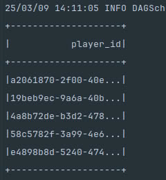
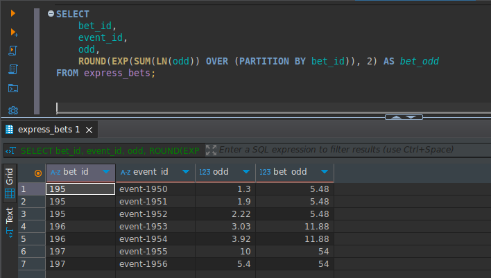

# Betera Data Processing Project

This project provides a PySpark-based solution to load, process, and query betting data using PostgreSQL and Docker. It includes CSV ingestion, schema creation, Spark transformations, and analytical queries.

---
## 🚀 Project Structure

```
betera/
├── data/                         # All CSV data files live here
│   ├── input/                    # Original CSV inputs used for ingestion
│   │   ├── bets.csv              # Raw bets data (loaded into PostgreSQL)
│   │   └── events.csv            # Raw events metadata (also loaded into PostgreSQL)
│   └── output/                   # Outputs generated by queries or data quality checks
│       ├── suspicious_express.csv  # Express bets with inconsistent result values
│       └── size_mismatch.csv       # Express bets where bet_size doesn't match number of events
│
├── sql/                          # SQL logic for schema and analytical queries
│   ├── schema/                   # Table & index definitions for PostgreSQL
│   │   ├── create_bets_table.sql       # CREATE TABLE for bets
│   │   ├── create_bets_indexes.sql    # Indexes for the bets table
│   │   ├── create_events_table.sql    # CREATE TABLE for events
│   │   └── create_events_indexes.sql  # Indexes for the events table
│   └── queries/                  # Analytical SQL queries (e.g., for task 1, task 2)
│       ├── query_task_1.sql           # SQL version of the query logic for Task 1
│       └── query_task_2.sql           # (optional future task)
│
├── src/                          # Core Python application code
│   ├── loaders/                  # Data ingestion logic using PySpark
│   │   ├── bets_data_loader.py        # Reads bets.csv and writes it to PostgreSQL
│   │   └── events_data_loader.py      # Same for events.csv
│   ├── queries/                  # Query execution logic
│   │   └── query_task_1.py            # PySpark implementation of Task 1
│   ├── utils/                    # Utility functions and helpers
│   │   └── logger_config.py           # Logging setup for consistent log formatting
│   └── data_quality.py           # Script to detect data issues (duplicates, mismatches, etc.)
│
├── .env                          # Environment variables (database creds, file paths, etc.)
├── .gitignore                    # Git ignored files (.venv, *.pyc, etc.)
├── Dockerfile                    # Builds Spark container with PostgreSQL JDBC driver
├── docker-compose.yaml           # Defines services: PostgreSQL, Spark master, Spark worker, pgAdmin
├── postgresql-42.5.0.jar         # PostgreSQL JDBC driver for Spark to use
├── requirements.txt              # Python dependencies (if running locally without Docker)
├── spark-defaults.conf           # Spark default configuration (optional)
└── README.md                     # Project documentation (setup, usage, structure)

```
---

## 🛠️ Tech Stack

- Python + PySpark
- PostgreSQL
- Docker & docker-compose
- pandas (for data quality)
- SQL (PostgreSQL dialect)
- DBeaver (for DB inspection)

---

## ⚙️ Setup Instructions
### 1. Clone the Repository
```
git clone https://github.com/Fox1ine/de_assignment.git
cd betera
```
### 2.Start Docker Services
```
docker-compose up --build
```
Services:
- PostgreSQL (port 5432)
- Spark Master (ports 7077, 8080)
- Spark Worker
- PgAdmin (http://localhost:5050)

### 3.Set Up DBeaver for This Project (optional)
Launch DBeaver & Create a New Connection:
- Open DBeaver 
- Click Database → New Database Connection
- Choose PostgreSQL → Click Next
- Set up ur credentials 


---

## How to Run the Project (via Docker):

### 1. Load Bets and Events Data:
```
docker exec -it spark /bin/bash -c "spark-submit --master spark://spark:7077 /opt/bitnami/spark/src/loaders/bets_data_loader.py"
docker exec -it spark /bin/bash -c "spark-submit --master spark://spark:7077 /opt/bitnami/spark/src/loaders/events_data_loader.py"
```
This will:
- Create tables from SQL files
- Load data from CSV
- Write to PostgreSQL via Spark JDBC

### 2.Run Task 1 Query (PySpark and SQL):
```
docker exec -it spark /bin/bash -c "spark-submit --master spark://spark:7077 /opt/bitnami/spark/src/queries/query_task_1.py"
```
Includes:
- ```run_query_with_pyspark:``` filters and aggregates using PySpark
- ```run_sql_file_query:``` executes the same logic from an SQL file

### Run Data Quality Check:
```
docker exec -it spark /bin/bash -c "spark-submit --master spark://spark:7077 /opt/bitnami/spark/src/data_quality.py"
```
Saves suspicious bets and mismatches to ```data/output/```

---

## Explanation of each important file:

### 📄1.bets_data_loader.py:
Purpose: Load and insert betting data from CSV into PostgreSQL using PySpark.
Key functionality:
- Loads environment variables (DB credentials, paths) from ```.env```
- Initializes Spark session with JDBC driver
- Reads bets.csv, ensures row_id exists
- Creates the bets table via SQL
- Selects necessary columns and writes the DataFrame to PostgreSQL
- Schema of table in ```sql/create_bets_table.sql```
- Creates indexes after insertion (code of indexes in ```sql/create_bets_indexes.sql```)

### Some words about index - 
Based on the business logic, I assumed that columns like create_time, settlement_time, and event_stage are critical for real-world analytics — for example, tracking when bets were placed and settled, or analyzing performance across different stages of an event. These types of queries are likely very common in any betting platform. That’s why I added indexes on those fields — to speed up time-based filtering and reporting. I also indexed event_id and player_id because in a real system, you'd often need to join bets with events and track player behavior — so these columns are also likely to be involved in joins and group-by operations.
Overall, I tried to choose indexes that would make sense not just technically, but in terms of how the system would be queried day-to-day by the business.

#### schema:

#### indexes:


#### My notes:
The Spark session is configured with the PostgreSQL JDBC driver to allow direct writes from Spark to the database. To optimize performance, I repartitioned the DataFrame before the write, which helps Spark parallelize the workload and avoid bottlenecks. Before writing, I dynamically filtered the columns according to the PostgreSQL schema to prevent schema mismatches and unnecessary columns like row_id. I also added row_id using monotonically_increasing_id to uniquely identify rows when needed. Finally, I used the JDBC batchsize option to write in large chunks, which reduced the number of database accesses and improved insertion performance.

### 📄2.events_data_loader.py:
Purpose: Same logic as the bets loader, but for events.csv.
#### Key functionality:
- Reads events.csv into a Spark DataFrame
- Creates the events table
- Loads the data into PostgreSQL using JDBC
- Adds indexes after data is loaded
#### schema:

#### indexes:


### Some words about index - 
For the events table, I added indexes based on what I believe would be common usage in a real betting system.
For example, event_id is obviously heavily used in joins with the bets table — so indexing that is essential. 
I also indexed sport, category, and event_stage because in practice, these fields would likely be used in filters for analytics, reporting, or building user-facing dashboards (e.g., filtering by sport type or showing only live/prematch events). 
I think these kinds of queries are very common in real business scenarios, so indexing those columns should help improve performance when slicing or aggregating event data across different dimensions.

### 📄3.query_task_1.py  TASK 1:
Purpose: Implements query logic for Task 1 using PySpark and SQL.
#### Key functionality:
- Loads both bets and events tables from PostgreSQL
- Joins them on event_id
Filters by:
- Create time after 2022-03-14 12:00:00
- Only Prematch stage
- Bet amount ≥ 10
- Settled before 2022-03-15 12:00:00
- Not a system bet or cashout/return
- Not a free bet
- Aggregates per bet: counts events, counts esports events, gets min odd
- Selects player_id if all events are E-Sports and all odds ≥ 1.5
- Also includes alternative: load SQL query from file and run via Spark SQL

#### My notes:
At first I wrote a basic SQL query that did everything in one step - connecting bets and events,
filtering into a line and grouping immediately.I noticed that the execution time was not very long, so I decided it was better to break it into logical steps.
That's why I introduced the CTE filtered_bets: it isolates all task-specific filters in advance (e.g. prematch, sum >= 10, no cashout, no system bets, etc.). 
This simplifies the logic and also allows the database to optimize this part on its own. 
I noticed performance improvements after doing this - especially when indexing, as the filtered subset gets smaller before merging.
In the next step, I grouped the data by bet_id and player_id to calculate how many total events were in each bet, how many of them were esports, and to take the minimum accepted_odd. I used COUNT(CASE WHEN...) instead of the window function because I only needed group-level statistics and it was cleaner that way. 
The last step was just sampling individual player_id, since the goal was to get a set of users matching all the criteria -- one row per player, no more. I added comments like -- Guess unic player_id to keep things a bit fun, but at the same time self-documenting. In general, I moved to a more layered approach because the logic was easier to debug, easier to maintain, and noticeably faster in practice.

#### A few words about queries:
I created two different SQL query versions for Task 1.
You can find them in:
- ```first_version_query_task1.sql``` — my initial implementation
- ```query_task_1.sql``` — the final version using a different approach

After writing the first version, I ran EXPLAIN ANALYZE and noticed that it took significantly longer to execute than expected, even on a relatively small dataset. This version relied heavily on multiple CTEs, subqueries, and filtering logic that introduced complexity and likely caused performance overhead.
As a result, I decided to try a more efficient approach using window functions. In the second version, I compute group-level metrics (like minimum odds and count of E-Sports events) directly using PARTITION BY, which significantly reduces complexity and improves performance.

#### ```first_version_query_task1.sql``` EXPLAIN ANALYZE:

#### ```query_task_1.sql``` EXPLAIN ANALYZE:


#### Screenshot of sql query result:

#### Screenshot of pySpark query result:



result is - 5 distinct players.


### 📄 4.data_quality.py:
Purpose: Detect anomalies in the bets dataset using pandas.
Checks performed:
- Duplicate Ordinar bets by bet_id + event_id
- Express bets with inconsistent results/profit/payout for the same event
- Express bets where the number of events doesn't match bet_size
Saves results to:
- suspicious_express.csv
- size_mismatch.csv
- Prints grouped examples and statistics

#### My notes:
Before loading the data into PostgreSQL, 
I decided to write a small data quality script using pandas. 
My goal was to better understand the data and the subject area itself - how different bet types behave, what values I can expect, and if there are any inconsistencies that could affect further analysis. 
In the course of my research, I found that the ordinals bets were clean - no duplicate bet_id and event_id combinations - but the express bets were much more confusing: 281 cases had conflicting result fields for the same bet_id and event_id, which looked suspicious.
I also found 345 express bets where the bet size did not match the actual number of events associated with it, which could lead to misinterpretations if left unchecked. However, since the job didn't explicitly say to clean or filter this data - or define what should be done in these situations - I decided to leave the raw data as is. 
I focused on identifying these issues rather than changing the dataset to stay within the scope of the task. 
I saved the results in CSV files in case they would be useful later for audits or follow-ups.
The data I found I uploaded to - size_mismatch.csv and suspicious_express.csv 


### 📄 5.query_task_2.sql TASK 2:
Purpose: Calculates the final bet_odd for each express bet by multiplying the odds of all related events.

Key functionality:
- Groups rows by bet_id
- Computes the product of all odd values for each bet using SQL aggregation
- Assigns the resulting bet_odd back to each row within the same bet
- Outputs a table where every row of the same bet_id has the same bet_odd

#### My notes:
Initially, I thought about solving it with a basic GROUP BY and then joining the aggregated result back to the original table, but I wanted a cleaner and more elegant approach — something that could be done inline, without extra joins. 
So I decided to use a window function with PARTITION BY bet_id to calculate the product of odds directly within each bet group. 
Since SQL doesn’t support a native PRODUCT() function, I used the mathematical trick EXP(SUM(LN(...))) to compute the same thing.
This approach allowed me to assign the final bet_odd to every event row of a given bet, without needing any joins or subqueries. 
It performs well, looks clean(in my humble opinion) , and fully matches the task requirement — to multiply all odd values for each bet. 
Using ROUND(..., 2) keeps the output user-friendly and consistent with the example provided. 

#### Screenshot of sql query result:

---

## 🧠 Final Thoughts

This project was about understanding the data, thinking through edge cases, and making design decisions that balance clarity and performance. I tried to approach each task as if it were part of a real production pipeline: using PySpark for scalability, SQL for readability, and Docker for portability. Even when something wasn’t strictly required (like the data quality checks), I still implemented it to better understand the dataset and potential issues downstream. Throughout the process, I iterated on my solutions — rewriting, optimizing, and asking “why this way?” until the logic felt clean and justifiable. If I had more time, I’d build a few automated tests, maybe some visualization or monitoring, and push this toward being a real deployable pipeline. But even as it stands, I’m proud of how the project turned out — structured, thoughtful, and extendable.

